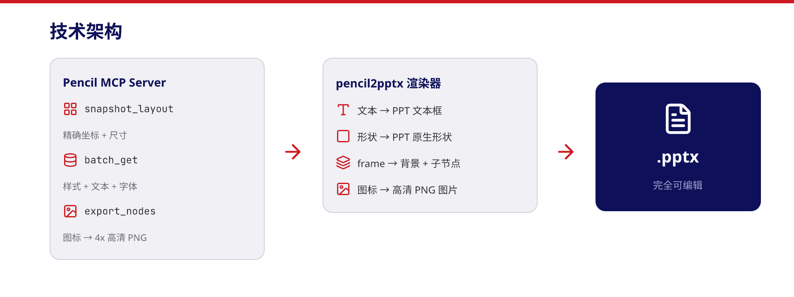

# pencil2pptx：企业级 AI PPT 设计工具


## 传统 AI PPT 的痛点

市面上的 AI PPT 工具（Gamma、Beautiful.ai、ChatPPT 等）有一个共同的硬伤：**模板化**。

你输入一段文字，AI 帮你选个模板、填上内容，看起来还行。但一旦涉及企业场景：

- 公司有自己的品牌规范（配色、字体、Logo 位置）
- 不同部门有不同的 PPT 模板要求
- 需要精确控制每个元素的位置和样式
- 导出的 PPT 要能自由编辑，不是图片拼贴

这些 AI 工具就力不从心了。你要么接受它的模板，要么花大量时间手动调整。

## 新思路：Pencil + pencil2pptx

我们提出一个不同的方案：

**用 Pencil 做设计，用 pencil2pptx 导出可编辑 PPT。**

### 第一步：在 Pencil 中设计

[Pencil](https://pencil.evolveui.com/) 是一个专业的设计工具，支持 AI 驱动的画布绘制。关键优势：

- **完全自定义**：不受模板限制，按企业品牌规范自由设计
- **AI 辅助**：通过 MCP 协议，AI Agent 可以直接在画布上绘制元素
- **Flexbox 布局**：专业的自动布局引擎，元素位置精确可控
- **实时预览**：所见即所得，设计效果即时呈现
- **丰富的图标库**：内置 Lucide 等图标字体，直接使用


### 第二步：一行命令导出 PPT

设计完成后，运行一行命令：

```bash
uvx pencil2pptx slides.pen -o slides.pptx
```

或者安装后使用：

```bash
pip install pencil2pptx
pencil2pptx slides.pen -o slides.pptx
```

**就这么简单。** 几秒钟后你就得到一个完全可编辑的 `.pptx` 文件。

### 第三步：在 PowerPoint 中自由编辑

导出的 PPT 不是图片拼贴，而是：

- **原生文本框**：双击即可编辑文字，字体、颜色、大小都保留
- **原生形状**：矩形、圆角矩形、椭圆、线条，都是 PPT 原生元素
- **高清图标**：icon_font 节点导出为 4x 高清 PNG，清晰锐利
- **精确布局**：坐标和尺寸由 Pencil 引擎计算，像素级精确

## 为什么这是企业级方案

### 1. 完全按企业规范设计

传统 AI PPT 工具的模板是通用的，无法适配企业内部的品牌规范。而 Pencil 是一个设计工具，你可以：

- 使用企业指定的配色方案
- 使用企业指定的字体
- 按照企业 PPT 模板的布局规范设计
- 创建可复用的组件（按钮、卡片、标题栏等），确保一致性

**AI 在 Pencil 中是设计助手，不是模板填充器。**

### 2. 导出的 PPT 完全可编辑

这是和截图/PDF 方案的本质区别。导出的 `.pptx` 文件中：

- 每个文本都是独立的文本框，可以修改内容、字体、颜色
- 每个形状都是 PPT 原生形状，可以调整大小、颜色、边框
- 图标是高清 PNG 图片，可以替换或调整
- 整体布局可以在 PowerPoint 中继续调整

这意味着设计师用 Pencil 做初版，业务人员可以在 PowerPoint 中做最终微调。

### 3. 工作流程高效

```
需求描述 → AI 在 Pencil 中设计 → pencil2pptx 导出 → PowerPoint 微调 → 完成
```


整个流程中：
- AI 负责设计和排版（最耗时的部分）
- pencil2pptx 负责格式转换（几秒钟）
- 人工只需要做最终审核和微调

## 技术原理

pencil2pptx 的核心思路是：**不自己算布局，让 Pencil 引擎算。**

```
Pencil MCP Server
    ├── snapshot_layout  → 获取计算后的精确坐标和尺寸
    ├── batch_get        → 获取节点属性（样式、文本、字体等）
    └── export_nodes     → 导出 icon_font 为高清 PNG
         ↓
    pencil2pptx 渲染器
    ├── 文本节点 → PPT 原生文本框
    ├── 矩形节点 → PPT 原生矩形/圆角矩形
    ├── frame 节点 → 背景矩形 + 递归渲染子节点
    └── icon_font → 插入导出的 PNG 图片
         ↓
    输出 .pptx 文件
```



通过 MCP（Model Context Protocol）协议连接 Pencil 桌面应用，所有布局计算都由 Pencil 的 Flexbox 引擎完成，pencil2pptx 只负责坐标转换（px → EMU）和元素创建。

## 快速上手

### 安装

```bash
pip install pencil2pptx
```

### 使用

1. 打开 Pencil 桌面应用
2. 在 Pencil 中设计你的幻灯片（每个顶层 frame 就是一页）
3. 运行转换命令：

```bash
pencil2pptx your-slides.pen -o output.pptx
```

### 参数调整

```bash
# 调整字体缩放系数（如果字体偏大或偏小）
pencil2pptx slides.pen --font-scale 0.70

# 指定 Pencil MCP server 路径（非默认安装位置时）
pencil2pptx slides.pen --pencil-cmd "/path/to/mcp-server"
```

## 开源

项目完全开源，欢迎 Star 和贡献：

- PyPI: [pencil2pptx](https://pypi.org/project/pencil2pptx/)
- GitHub: [github.com/xuejike/pencil2pptx](https://github.com/xuejike/pencil2pptx)

---

*pencil2pptx — 让 AI 设计的 PPT 真正可用。*
